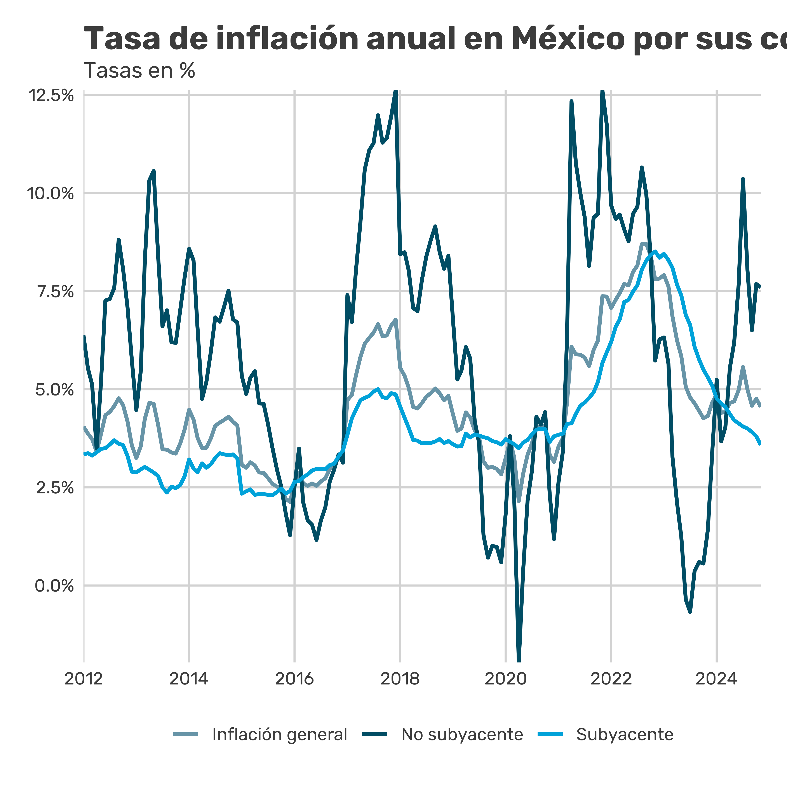

## Target Interest Rate

Key indicator of Banco de México's monetary policy. A high rate generally aims at a restrictive policy to control inflation, while a low rate seeks to stimulate growth.

## Inflation and Prices

Inflation shows how prices increase over time and affects purchasing power. It is divided into core (stable) and non-core (volatile). It is crucial to monitor spikes in headline inflation and changes in core inflation, as they indicate long-term trends.

## Inflation Breakdown by Sector

Helps identify which sectors are driving inflation. Significant changes in specific sectors, such as energy or food, may reflect cyclical or supply-side problems.

## Monetary Aggregates (M1, M2)

They indicate the amount of money in the economy and available liquidity. Accelerated growth can signal an increase in consumption and investment, but can also cause inflation. Look at changes in M1 and M2 to understand monetary policy.
